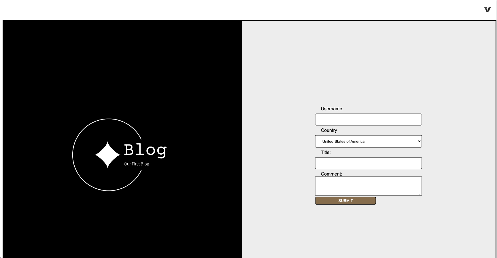

# Blog

Blog Challenge Week 4

My Challenge Work Process

    1. Looked a Directive
    2. Layed out the page with figma

    3. Used Form to setup submission
    4. Defined Color Pallet
    5. Used css to define the style and look of the web pages
    6. Made sure to link all words, files, and web links
    7. Commented on each sections of importance 
    8. Used all resource to help make sure the page properly display multi blog post to the local storage
    9. Used Text for the return back to home page

    A. Made sure to use right syntex structure to have code be more presentable (cleaned up)
    B. Added section dividers to each section using this structure: <!--blank-->
    C. Consolidated consolidated code and expanded on classes 

[deployed link]()
